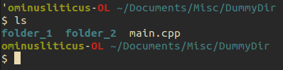
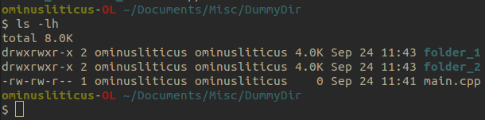
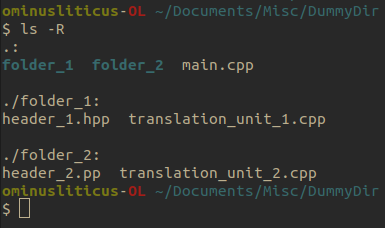
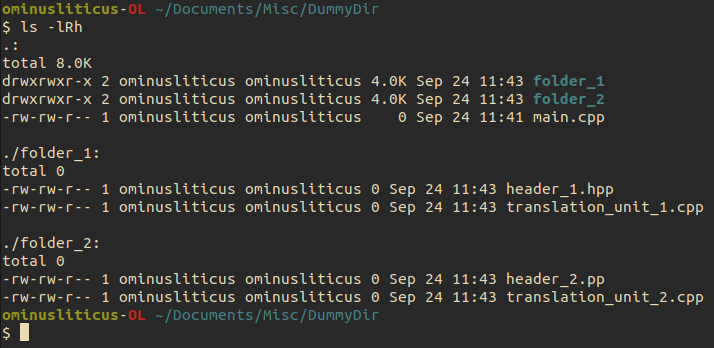

# The Command Line
Before computers has _windows_ and a mouse to navigate between applications, all computing happened view text that was entered a single line at a time.
Despite the seemingly limited form of operability that this seems to offer, it is this minimal interface that we will start with.

Different operating systems typically have different command line interfaces.
This boils down to the commands that you can enter to make the computer do something like: create/delete a file, navigate between directory, etc.
We will solely focus on POSIX systems, these include what you would find in most Linux operating systems and MacOS.

## Opening a terminal
To open a terminal you can press
- `<Space>`+`<Cmd>` on MacOs, then type `terminal` and press `<Enter>`
- `<Super>` on Linux and type `terminal` and find your terminal application

## The four most basic commands
The four most basic commands that you will need whenever navigating files on POSIX systems are
- `cd` - Change director
- `ls` - list files in directory
- `mkdir` - create a directory
- `rm` - remove a file

:::{note}
As we familiarize ourselves with C++, we will be able to understand how file structures work, should you want to appreciate the plumbing that goes into designing operating systems.
:::

Each command comes with a set of _flags_ that you can pass to modify the behavior of the command.
To see some examples, you can click on the drop down menu. 

### Flags for common POSIX commands
Here I include some example commands and their flags and show what their execution looks like
<details>
  <summary> cd </summary>
  
  This command requires you to feed it an argument, namely the path of the directory you want to change to, to work.
  There are no flags we will ever really need to worry about.  
  ```bash
  cd path/to/dir
  ```

</details>

<details>
  <summary> ls </summary>
  
  ````{tab} ls  
  Here is an example of output for `ls` in a directory (Linux refers to folders as directories) with one file and two subdirectories.  
  

  You can also give `ls` a _path_ to a directory, and it will return what is in that directory.  
  
  ````
  ````{tab} ls -1
  Lists items in directory one item per line.  
  
  ````
  ````{tab} ls -l 
  Lists all items in directory with additional information, such as, privileges, file size, last modified time stamp, file owner and file name.  
  

  We can add the `h` flag to indicate that the memory should be in human readable units.  
  
  ````
  ````{tab} ls -R 
  List items in directory, and recursively iterate through subdirectory to show items in those directories as well.  
  
  ````
  ````{tab} ls -lRh 
  As was implicitly shown before, we can combine flags to preform a desired behavior.
  Here, we list all the information about the the files, recursively, with a human readable size format.
  Note, that the order of the flags does not matter in this case.  
  
  ````

</details>

<details>

  <summary> mkdir </summary>
  
  Like `cd`, this command requires and argument to execute.
  You can create multiple directories by separating the list by spaces.
  ```bash
  mkdir dir1 dir2 dir3
  ```

  :::{note} 
  File and directory names are space sensitive in POSIX systems. 
  Your file names and directory names should always be a consecutive string of characters.
  :::

  There is really only one flag the might be useful here

  ````{tab} mkdir -p
  Creates a directory. 
  If given a path, it creates all the _parent_ directories as well
  ```bash
  mkdir -p dir1/dir2/dir2 
  ```
  ````

</details>

<details>

  <summary> rm </summary>
    
  Like `cd` and `mkdir` this command requires an argument to execute.
  Giving a list of space separated paths deletes all the files those paths point to.
  This command can be very dangerous, especially if you add the following to flags that I will show you.
  **Always be certain to double check where you are and what the `rm` command will do before you execute it.**

  ````{tab} rm -r
  This flag is need if you want to remove a directory; the _r_ stands for _recursive_.
  ````
  ````{tab} rm -f
  Sometimes when you delete a file, the operating system will ask you to verify whether you are sure you want to remove said file.
  The `-f` flag allows you to circumvent this inconvenience if you are sure you want to delete said file.
  This flag can be combine with the `-r` flag to _forcelly_ remove a directory or list of directories and files.
  ````

</details>

## Less common by still useful commands

We just saw what I called the four most common commands.
There are many, many more that ship with Linux out of the box and many more that you can add by install applications.
Some more common ones that we will see throughout this tutorial which ship with POSIX systems include:
- `cp` - copy allows you to move files (or directories with the `-r` flag). You can think of this as copy-and-paste
- `mv` - move/rename file or directory paths. You can think of this as cut-and-paste.
- `cat` - outputs the contents of a file to the _standard out_, the terminal itself.
- `git` - a version controlling software that we will be working with extensively
- `vim` - a command line text editor many people hate, but you should still have some familiarity with.

Some more commands that are related to programs we will install to run are
- `gcc` or `clang` - these are C/C++ compilers
- `python` - the python interpreter
- `code` - short of VS Code, a very popular code editor
- `noevim` - my favorite text editor
- `gdb` - a C/C++ runtime debugger

### Help documentation
Any and all commands running on you systems have a help feature or a _man page_ that give in depth documentation on how the command is used and the various flags you use to modify the program behavior.
The two ways of accessing this documentation are  
```bash
<command> --help
man <command>
```
where you would replace `<command>` with the command you are trying to interrogate.
