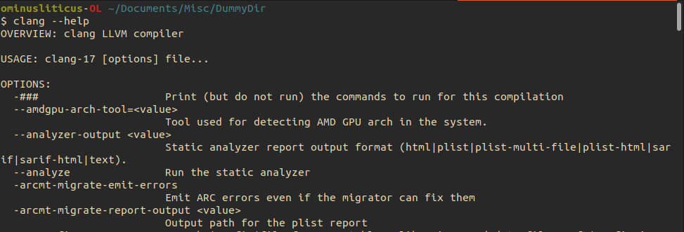
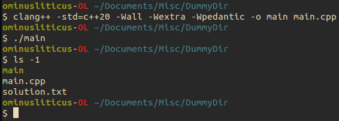

# Creating a C++ Project

In this chapter we describe how C++ compilation works, how to setup a C++ project using a build system, and create a sample project using our RK4 example from the last chapter.
By the end of this chapter, you should be able to:
1. Describe what a C++ compiler does/how it works
1. Compile C++ files into an executable program
1. Generate a Makefile to build your project

## Getting familiar with the compiler

We are now dangerous enought with C++ to be able to solve differential equations.
However, it is rare for a C++ program to be expressible in a single file.
This is typically because we use files to logically organize and separate distinct parts of code.
In C++, there are two types of files:

1. _Header files_: these typically contain function declarations, class defintions, and templated code (this is a whole can of worms). 
These are easily identified by their file ending: `.h`, `.hpp`, `.hxx` and a couple others (import is the _h_).
1. _Translation units_: these typically contain function bodies and static content which does not matter for other translation units.
These are easily identified by their file ending: `.cpp`, `.C`, `.cxx`, and several other (import is the _c_).

C++ is a compiled language, meaning that what you write needs to translated, by a compiler, into machine code for the computer to understand.
The compilation process has several stages, but the only two that really matter for us are _machine code generation_ and _linking_ steps.
During the _machine code generation_ step, the compiler pastes all header files into a translation unit and outputs and object file (a `.o` file).
During the linking steps, all the `.o` files are combined into and _executable_.
Linking is important because all the header files tell the compiler is that a function _exists_, not where to find it. 
The linker goes through all the `.o` files and matches function names to their definitions.
The compiler can distinguish between header files and translation units by their file endings.

The two most common compilers are `gcc` (the Gnu C compiler) and `clang` a much newer compiler with more fancy features that `gcc`.
How these work unde the hood is completely irrelevant to us, and for the sake of these tutorials I will use `clang` as this is readily available on MacOS (install `gcc` can be a pain).

As with any command, you should always explore what functionality the command has by querying it with `--help` option.
The first several lines for `clang --help` should look like this: 
As you can see, there is far more information here than we care to digest. 
Luckily, we don't need all this; the flags we care about are
- `-std=<standard>` - this specifies which ISO standard the compiler should use.
The most recent standard in `c++23`, but for our purpose, we will always use the `c++20` option.
- `-Wall -Wextra -Wpedantic` - these three flags tell the compiler to be extra fastidious with looking for potential errors or mistakes you could have made in writing your code, like
declaring an unused variable, not providing a return statement for a function, or using uninitialized variables.
- `-c` - this tells the compiler to output a `.o` file as described abouve
- `-o` - this allows us to specify the output file path/name

## Compiling your first program

We are now ready to compile your first program.
You will want to copy the exam,ple code for th RK4 method into a file named `main.cpp`.
Then, open a terminal and navigate to the directory where you saved the `main.cpp` file.
Now, we can execute the following command

```bash
clang++ -std=c++20 -Wall -Wextra -Wpedantic -o main main.cpp
```
This command creates an executable called `main` using the input file `main.cpp`. 
:::{note}
We did not use the `-c` flag here. 
This will only really become import when we have multiple files and complicated projects.
For more complex projects, we will use _build systems_ that will do much of this work for us.
:::
To execute the program, we run the comand
```bash
./main
```
This should have created a file names `solution.txt` in your directory



## Build systems for C++

There are many ways to setup large complicated projects and automate their compiling and linking process.
The systems that facilitate this automation are called _build systsems_.
Some popular ones are:
- Makefiles
- CMake
- Premake
- Meson
- magini (my very own, and not yet popular)
- Shell scripting

Below, I will give examples of Makefiles, CMake, Shell scripting and magini on how to setup you build script.
Learning these is like learning another programming language (besides magini), and will often come with its own set of growing pains.
I will not try to develop much of your fluency in these, and leave it to your disgression, which build system you try.
Whenever possible, I will give the build scripts in the four examples listed above.

### Creating a project structure

The words _project structure_ essentailly boil down to how the files are organized within you directories.
There might be a meaningful way to group them, say because a bunch of files are for math and a bunch of others are for plotting routines.
Regardless, build systems have to be made aware of this structure to know how to build your project properly.
Some of the most annoying build errors arise because some one else's build instructions had loopholes which you have to figure out how to fill.

We are now going to separat our `main.cpp` file into three files
- `main.cpp` - it will only contain `int main` function that calls the `RK4` function defined in `RK4.cpp`
- `RK4.hpp` - it will contain the _decalaration_ of the `RK4` function
- `RK4.cpp` - it will contain the _definition_ of the `RK4` function

````{tab} main.cpp
```c++
#include <fstream>
#include <iomanip> // input/output manipulation - used to format output
#include <cmath>   // For std::exp and std::cosh

// We don't have to define the function yet, so the compiler knows the symbol exists.
// This is called _prototyping a function_
double f(double x, double t);

int main()
{
    // Open output file
    std::fstream fout("solution.txt", std::fstream::out);

    double t_0 = 0.0;  // Start time
    double x_0 = 0.0;  // Initial condition

    double t_f = 10.0;     // End time
    const size_t N = 100;  // Number of steps 

    double x[N];
    RK4(x, x_0, t_0, t_f, N, f);

    for (size_t i = 0; i < N - 1; ++i)
        fout << x[i] << '\n';

    // Our logic above implies that we would not output the last step, so we do it 
    // explicitly
    fout << t << x[N - 1];
    
    // Close file
    fout.close();
    
    return 0;
}

// An arbitrary choice
double f(double x, double t)
{
    return std::exp(t) / std::cosh(x);
}
```
````
````{tab} RK4.hpp
```c++
#ifndef _RK4_HPP_
#define _RK4_HPP_

// Functions should _documented_ with their definitions to tell others what it does
// and how to use it. What this looks like is up to you, although there are standards
// like doxygen

/* The Runge-Kutta method at 4-th order for ordinary differential equations
 * 
 * Arguments:
 * ----------
 * double x    pointer to array storing numerical solution
 * double t_0  Start time
 * double x_0  Initial condition
 * double t_f  End time
 * size_t N    Number of steps 
 *        f    a function pointer to a function of return type double and takes two 
 *             arguments of type double
 */
void RK4(double *x,
        double x_0,
        double t_0,
        double t_f, 
        size_t N,
        double (*f)(double,double))

#endif
```
````
````{tab} RK4.cpp
```c++
#include "RK4.hpp"

void RK4(double *x,
        double x_0,
        double t_0, 
        double t_f,
        size_t N,
        double (*f)(double, double))
{
    // Integral numbers and floating point numbers are reppresented differently in binary
    // To make sure the compiler knows which types are being multiplied we can hint to it 
    // what the types should be by casting, in this case `static_cast`-ing (meaning the 
    // compiler can do this at compile times), the desired type.
    double h = (t_f - t_0) / static_cast<double>(N); 

    double k_1, k_2, k_3, k_4;
    
    double t = t_0;
    x[0] = x_0;
    for (size_t n = 0; n < N - 1; ++n)
    {
        // output current step to file
        fout << std::setw(3) << std::setprecision(2) << t << ' ';
        fout << std::setw(9) << std::setprecision(6) << x[n] << '\n';

        // Calculate next step
        k_1 = f(x[n], t_0);
        k_2 = f(x[n] + 0.5 * k_1 * h, t + 0.5 * h);
        k_3 = f(x[n] + 0.5 * k_2 * h, t + 0.5 * h);
        k_4 = f(x[n] + k_3 * h, t + h);

        x[n + 1] = x[n] + h * (k_1 + 3.0 * k_2 + 3.0 * k_3 + k_4);

        // Update time 
        t += h;
    }
}
```
````

This is a very C-style form of programming.
We have used the pointer `*` notation to tell C++ to only keep track of where the array of string starts.
This means that when we edit and entry in the array, `x[i]`, we edit it in place (overwrite its value).
Such functionality is convenient when you data is very large and it would be expensive to spend CPU cycles copying from one address to another address.
In the case of the function pointer `(*)`, functions always have fixed address in programs (this is for linking to make sense).
You can name the pointer to the address of a function, like we did, by adding a variable name after the astric: `(*f)`.
In the function body, we use `f` as any other function.

A C++ style would take advantage of template parameters and variadic templates.
I inlcude here an example without going into any detail, just to show how different two can be

<details>
  <summary> Click to see the more moden C++-style code </summary>

  ````{tab} main.cpp
  ```c++
  #include <fstream>
  #include <iomanip> // input/output manipulation - used to format output
  #include <cmath>   // For std::exp and std::cosh
  
  // We don't have to define the function yet, so the compiler knows the symbol exists.
  // This is called _prototyping a function_
  double f(double x, double t);
  
  int main()
  {
      // Open output file
      std::fstream fout("solution.txt", std::fstream::out);
  
      double t_0 = 0.0;  // Start time
      double x_0 = 0.0;  // Initial condition
  
      double t_f = 10.0;     // End time
      const size_t N = 100;  // Number of steps 
  
      double x[N];
      RK4(x, x_0, t_0, t_f, N, f);
  
      for (size_t i = 0; i < N - 1; ++i)
          fout << x[i] << '\n';
  
      // Our logic above implies that we would not output the last step, so we do it 
      // explicitly
      fout << t << x[N - 1];
      
      // Close file
      fout.close();
      
      return 0;
  }
  
  // An arbitrary choice
  double f(double x, double t)
  {
      return std::exp(t) / std::cosh(x);
  }
  ```
  ````
  ````{tab} RK4.hpp
  ```c++
  #ifndef _RK4_HPP_
  #define _RK4_HPP_

  #include <array>
  #include <function>
  
  // Functions should _documented_ with their definitions to tell others what it does
  // and how to use it. What this looks like is up to you, although there are standards
  // like doxygen
  
  /* The Runge-Kutta method at 4-th order for ordinary differential equations
   * 
   * Arguments:
   * ----------
   * std::array<double, N>&                 x    reference to array storing variable
   * double                                 t_0  Start time
   * double                                 x_0  Initial condition
   * double                                 t_f  End time
   * size_t                                 N    Number of steps 
   * std::function<double(double, double)>  f    a function abstraction for function of
   *                                             return type double and takes one 
   *                                             argument of type double
   */
  template<int N>
  void RK4(std::array<double, N>& x,
           double x_0,
           double t_0,
           double t_f,
           std::function<double(double, double)> f)
  {
      // Integral numbers and floating point numbers are reppresented differently in binary
      // To make sure the compiler knows which types are being multiplied we can hint to it 
      // what the types should be by casting, in this case `static_cast`-ing (meaning the 
      // compiler can do this at compile times), the desired type.
      double h = (t_f - t_0) / static_cast<double>(N); 
  
      double k_1, k_2, k_3, k_4;
      
      double t = t_0;
      x[0] = x_0;
      for (size_t n = 0; n < N - 1; ++n)
      {
          // output current step to file
          fout << std::setw(3) << std::setprecision(2) << t << ' ';
          fout << std::setw(9) << std::setprecision(6) << x[n] << '\n';
  
          // Calculate next step
          k_1 = f(x[n], t_0);
          k_2 = f(x[n] + 0.5 * k_1 * h, t + 0.5 * h);
          k_3 = f(x[n] + 0.5 * k_2 * h, t + 0.5 * h);
          k_4 = f(x[n] + k_3 * h, t + h);
  
          x[n + 1] = x[n] + h * (k_1 + 3.0 * k_2 + 3.0 * k_3 + k_4);
  
          // Update time 
          t += h;
      }
  }

  #endif
  ```
    ````
</details>

### Writing a build script

With the project structure in hand, we can set about writing a build script.
Below I include build scripts for this projects and how to run them.
Some can be extended to more complicated projects with minimal work, and none show the truly show how truly complex the build scripts themselves can actually be.


